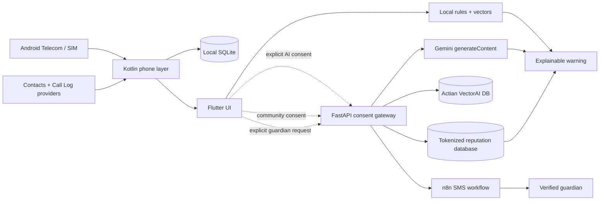

# Kavasam

Kavasam is an Android default-phone application that combines reliable offline calling with consent-controlled online caller reputation and AI-assisted scam safety. Normal SIM calls, contacts, recents, call controls, local caller ID, local spam scoring, and blocking continue to work when the gateway or internet is unavailable.

The project is designed around one rule: **cloud intelligence may improve safety, but it must never become a dependency for placing, receiving, answering, or rejecting a call.**

## Project status

| Area | Status | Notes |
|---|---|---|
| Android default dialer | Working | Real carrier calls through Android Telecom |
| Incoming-call screening | Working | Local decision path; no network dependency |
| Contacts and recents | Working | Read from Android providers after permission |
| Local caller reputation | Working | SQLite profiles, reports, trust, blocking, labels |
| Local vector risk scoring | Working | Deterministic on-device behavior vectors |
| Actian VectorAI DB | Integrated | Real online scam-pattern collection, upsert, and nearest-neighbor search |
| Per-call safety tracking | Working | User starts and stops tracking explicitly |
| Guardian SMS approval | Implemented | Verified opt-in and n8n/SMS credentials required for live delivery |
| Community caller ID | Working | Requires the optional gateway and separate consent |
| Gemini safety reasoning | Integrated | Uses Gemini when a server key exists; otherwise explainable fallback |
| Render deployment | Demo-ready | Free Blueprint included; gateway data is ephemeral |
| Cellular-call recording | Not supported | Deliberately excluded; normal Android apps cannot reliably capture it |
| Production signing | Required before release | Debug signing is used for development builds |

Current mobile version: **4.0.0**.

## Features

### Phone application

- Real incoming and outgoing SIM/carrier calls
- Android default-dialer and call-screening role setup
- Answer, reject, disconnect, mute, speaker, hold, and resume controls
- In-call DTMF keypad for automated phone menus
- Searchable Android contacts and system call history
- Speed dial from starred contacts
- Incoming, outgoing, missed, rejected, blocked, and voicemail call types

### Offline caller ID and spam protection

- Saved-contact caller names
- Private caller names and notes stored locally
- Mark trusted, report spam, block, and unblock actions
- Categorized reports for financial fraud, impersonation, delivery scams, telemarketing, robocalls, harassment, and other spam
- Explainable risk score based on reports, repeated-call bursts, unknown status, carrier verification, and block state
- Compact on-device vector similarity against suspicious-call behavior
- Optional automatic rejection of private, unknown, or locally high-risk callers
- Automatic rules are off by default and can be changed under **Insights**

### Consent-first call safety

- **Track this call for safety** button, off at the beginning of every call
- User-confirmed signals for OTP/PIN requests, urgent payments, remote access, impersonation, secrecy/urgency, and threats
- Live local suspicion score and reasons
- Optional Gemini second opinion using a redacted structured event
- Advisory actions rather than irreversible AI decisions
- No call audio, transcript, or covert Accessibility Service workaround

### Guardian approval for suspicious calls

- Guardian enrollment requires an explicit `JOIN #code` SMS reply before use
- User-triggered approval pauses and mutes the call while n8n delivers the SMS
- `ACCEPT #code` resumes; `REJECT #code`, no reply within five minutes, or delivery failure ends the call
- Multiple pending requests require the four-digit reference code
- Only the local risk summary, selected signal keys, and caller's last four digits are sent
- The gateway stores a keyed guardian-number token and approval audit state, never the raw number

### Community caller reputation

- Separate consent from AI safety analysis
- Online lookup for incoming or dialed phone numbers
- Unique reporter deduplication using a persistent random installation UUID
- Server-side HMAC conversion before storage
- The database stores keyed tokens and report categories, not raw phone numbers or reporter UUIDs
- Community risk, report count, confidence, and category fused with the local assessment in the UI

## Architecture



The native call-screening service never waits for the gateway. Android screening uses only contacts, locally stored reputation, carrier verification, and user-selected blocking rules. Online results are displayed as a second layer after the caller UI opens.

## Data boundaries

| Capability | Sent to gateway | Stored by gateway |
|---|---|---|
| AI safety | Random session UUID, local risk, vector similarity, selected signal keys, three caller-context booleans, locale | No raw request retention |
| Actian vectors | The same redacted safety fields encoded as a 12-value behavior vector | Versioned scam prototypes and no caller PII |
| Community lookup | Phone number over HTTPS | Server-HMAC number token only |
| Community report | Phone number, random reporter UUID, category | HMAC number token, HMAC reporter token, category, timestamps |
| Guardian enrollment | Guardian number, primary user's chosen alias | HMAC guardian-number token, random device/enrollment IDs, state and timestamps |
| Guardian approval | Guardian number, alias, risk summary, selected signals, caller's last four digits | HMAC number token, random request IDs, decision state and timestamps |
| Contacts | Nothing | Nothing |
| Call history | Nothing | Nothing |
| Call audio/transcript | Nothing | Nothing |

AI safety and community caller ID have independent switches. Both default to off. API keys stay on the server and must never be compiled into the APK.

## Repository layout

```text
kavasam/
├── mobile/                     Flutter UI and native Android Telecom code
│   ├── lib/                    Dart models, services, and screens
│   ├── android/app/src/main/   Kotlin dialer, screening, storage, and tracking
│   └── test/                   Flutter model and widget tests
├── cloud/                      FastAPI consent gateway
│   ├── app/                    API schemas, Gemini analyzer, reputation store
│   ├── tests/                  Privacy, API, and reputation tests
│   └── Dockerfile              Production container
├── docs/                       Sponsor architecture and implementation notes
├── scripts/start-hybrid.ps1    One-command local gateway/build/install flow
└── render.yaml                 Render Blueprint
```

## Requirements

- Flutter SDK compatible with Dart `^3.12.1`
- Android SDK with platform tools
- Java 17
- Python 3.11 or newer
- A physical Android phone with telephony and an active SIM
- USB debugging for local installation
- Optional Gemini API key for real Gemini responses
- Docker Desktop or an external Actian VectorAI DB instance for online vector retrieval

Browser, desktop, and iOS builds cannot become Android's system phone application.

## Quick start: offline caller

The default build does not contain a gateway URL. All caller functionality remains available, while both online switches report that the gateway is not configured.

```powershell
cd C:\WorkSpace\Private\kavasam\mobile

$env:TEMP='C:\WorkSpace\Private\kavasam\.jtmp'
$env:TMP='C:\WorkSpace\Private\kavasam\.jtmp'

flutter pub get
flutter analyze
flutter test
flutter build apk --debug

& 'C:\Android\Sdk\platform-tools\adb.exe' install -r `
  build\app\outputs\flutter-apk\app-debug.apk
```

The APK is generated at `mobile/build/app/outputs/flutter-apk/app-debug.apk`.

If Windows reports `Unable to establish loopback connection` while Gradle is
starting, run the repository's **Build Android demo APK** GitHub Actions
workflow. It performs analysis, tests, Android lint, and a clean release build,
then publishes an installable `kavasam-android-demo` artifact. The demo artifact
uses `http://127.0.0.1:8080`; keep the USB connection and ADB reverse tunnel
active to use the local Gemini/Actian gateway:

```powershell
& 'C:\Android\Sdk\platform-tools\adb.exe' reverse tcp:8080 tcp:8080
& 'C:\Android\Sdk\platform-tools\adb.exe' install -r .\app-release.apk
```

## Quick start: local hybrid mode

The helper script starts the local gateway, creates an ADB reverse tunnel, compiles the gateway URL into the debug APK, installs it, restores the Android roles, and launches Kavasam.

```powershell
cd C:\WorkSpace\Private\kavasam

python -m venv cloud\.venv
.\cloud\.venv\Scripts\python.exe -m pip install -r cloud\requirements.txt

.\scripts\start-hybrid.ps1
```

Then open **Insights** and enable either or both:

1. **Optional cloud AI** — redacted structured scam-safety analysis.
2. **Community caller ID** — phone-number lookup and categorized community reports.

Local hybrid mode requires the USB connection and `adb reverse tcp:8080 tcp:8080` to remain active. Community reputation works without Gemini. Without `GEMINI_API_KEY`, the safety endpoint returns the tested `rules-fallback` response and labels its source honestly.

### Start Actian VectorAI DB and the gateway

Review Actian's EULA, set `ACTIAN_VECTORAI_ACCEPT_EULA=YES` in the ignored `cloud/.env`, then run:

```powershell
cd C:\WorkSpace\Private\kavasam
docker compose up -d vectorai gateway
Invoke-RestMethod http://127.0.0.1:8080/health
```

The first consented safety request creates `kavasam_scam_patterns`, upserts the built-in prototypes, and performs a real Actian nearest-neighbor search. Full setup and production configuration are in [docs/ACTIAN_VECTORAI_SETUP.md](docs/ACTIAN_VECTORAI_SETUP.md).

Docker Compose persists the gateway SQLite database under the ignored local
`data/` directory and the Actian index under `actian_data/`. Recreating either
container therefore keeps local demo data and vector indexes intact.

## Run the gateway manually

```powershell
cd C:\WorkSpace\Private\kavasam\cloud
python -m venv .venv
.\.venv\Scripts\python.exe -m pip install -r requirements.txt

# Optional. Set this only in the gateway process or deployment secrets.
$env:GEMINI_API_KEY='your-private-server-key'
$env:GEMINI_MODEL='gemini-3.5-flash-lite'
$env:NUMBER_HMAC_SECRET='a-long-random-production-secret'
$env:KAVASAM_DB_PATH='data/kavasam.db'
$env:ACTIAN_VECTORAI_URL='http://127.0.0.1:6573'
$env:ACTIAN_VECTORAI_COLLECTION='kavasam_scam_patterns'

# Required only for live guardian SMS approval.
$env:N8N_WEBHOOK_URL='https://your-n8n.example/webhook/kavasam-guardian'
$env:N8N_WEBHOOK_SECRET='a-separate-long-random-secret'
$env:PUBLIC_BASE_URL='https://your-gateway.example'

.\.venv\Scripts\python.exe -m uvicorn app.main:app `
  --host 127.0.0.1 --port 8080
```

Health and API documentation:

- `GET http://127.0.0.1:8080/health`
- `GET http://127.0.0.1:8080/docs`

Guardian SMS remains unavailable until all three n8n variables above are present. The n8n workflow must send the supplied `message` to `to`, then forward inbound SMS replies to `replyWebhookUrl` with the same `X-Kavasam-Webhook-Secret` header. For India production traffic, complete the provider's TRAI DLT sender/template registration.

The exact workflow contract and production checklist are in [docs/N8N_GUARDIAN_SMS_SETUP.md](docs/N8N_GUARDIAN_SMS_SETUP.md).

## Gateway API

### Safety analysis

`POST /v1/safety/analyze`

```json
{
  "schemaVersion": 1,
  "sessionId": "b50a24e1-992f-4a87-b3d5-1ff36d8b0f74",
  "localRisk": 68,
  "vectorSimilarity": 0.81,
  "signals": ["otp_pin", "secrecy_urgency"],
  "callerContext": {
    "savedContact": false,
    "locallyReported": true,
    "carrierVerificationFailed": false
  },
  "locale": "en-IN"
}
```

The schema rejects extra fields. Phone numbers, names, audio, transcripts, and call history receive HTTP 422 if included.

### Reputation lookup

`POST /v1/reputation/lookup`

```json
{
  "phoneNumber": "+919000000001"
}
```

### Reputation report

`POST /v1/reputation/report`

```json
{
  "phoneNumber": "+919000000001",
  "reporterId": "b50a24e1-992f-4a87-b3d5-1ff36d8b0f74",
  "category": "financial_fraud"
}
```

One reporter contributes at most one active category per number. A repeated report updates the category rather than inflating the count.

## Free demo deployment on Render

1. Connect the repository to Render.
2. Create services from `render.yaml`.
3. Add `GEMINI_API_KEY` as a secret.
4. Keep the generated `NUMBER_HMAC_SECRET` stable. Rotating it makes existing number tokens unsearchable.
5. Verify `https://your-service/health`.
6. Build the app with the HTTPS endpoint:

```powershell
cd mobile
flutter build apk --release `
  --dart-define=KAVASAM_AI_BASE_URL=https://your-service.example
```

Replace debug signing in `mobile/android/app/build.gradle.kts` with a protected release keystore before distribution.

The included Blueprint explicitly uses Render's `free` web-service plan and `/tmp/kavasam.db`. Free services have ephemeral filesystems, so community reports, guardian enrollments, and pending approvals reset after a restart, redeploy, or spin-down. This is intentional for the hackathon demo and must be replaced with managed persistent storage before production use.

## First-launch setup

1. Tap **Make Kavasam my phone app** and approve the Android dialer role.
2. Tap **Enable caller ID** and approve the call-screening role.
3. Grant Contacts access for saved caller names.
4. Grant Call Log access for system recents.
5. Review automatic blocking rules under **Insights**; all remain off until enabled.
6. Enable cloud features only after reviewing their separate data disclosures.

## Testing

### Mobile

```powershell
cd mobile
flutter analyze
flutter test
flutter build apk --debug
```

The current suite covers models, safety sessions, community reputation parsing, protection rules, and primary dialer rendering.

### Gateway

```powershell
cd cloud
.\.venv\Scripts\python.exe -m pytest -q
```

The gateway suite verifies:

- AI schema rejection of phone numbers, names, audio, transcripts, and call history
- Unknown-signal rejection
- Explainable and bounded fallback decisions
- HTTP no-store headers
- Community report deduplication
- Absence of raw numbers and reporter UUIDs from the SQLite dump
- Confidence growth across independent reporters
- Neutral results for unknown numbers
- Guardian number tokenization and explicit SMS opt-in
- Approval reply parsing, reference matching, and non-approval of malformed replies
- Actian collection creation, pattern upsert, vector search, authentication, attribution, and fail-open behavior

## Security notes

- Android backups are disabled for the application.
- The APK requests `INTERNET` only for optional online features and does not request `RECORD_AUDIO`.
- Cloud endpoints must use HTTPS outside localhost development.
- The gateway sets `Cache-Control: no-store`, `Pragma: no-cache`, and `X-Content-Type-Options: nosniff`.
- Gemini output is schema-validated and advisory.
- AI never contacts a guardian by itself. Only the user's visible **Ask guardian to continue** action starts the fail-closed SMS flow.
- Automatic screening decisions use deterministic local data only.
- Production deployments must add authentication/rate limiting before accepting reports from the public internet.

## Known limitations

- The community database starts empty and becomes useful as independent reports accumulate.
- SQLite remains the small community-report store. Actian VectorAI DB is the implemented vector engine; a live instance is required to show `actian-vectorai` instead of the explicit fallback state.
- The current build does not upload contact directories or provide a crowd-sourced personal-name directory.
- Live Gemini responses require a valid server-side key and supported model.
- Live guardian approval requires a two-way SMS provider connected through n8n; local calling remains independent of it.
- Cellular call audio is not recorded or transcribed.
- Local hybrid mode stops working when the computer gateway, USB connection, or ADB reverse tunnel stops.
- Production Play Store distribution requires release signing, policy review, privacy disclosures, and default-handler permission compliance.

## Troubleshooting

### “Gateway not configured”

The APK was built without `KAVASAM_AI_BASE_URL`. Rebuild with an HTTPS production URL or run `scripts/start-hybrid.ps1` for the local demo.

### “Cloud unavailable”

Check gateway health and, in local mode, restore the tunnel:

```powershell
Invoke-RestMethod http://127.0.0.1:8080/health
adb reverse tcp:8080 tcp:8080
adb reverse --list
```

Local caller ID and call controls remain active during this error.

### Kavasam is not the phone app

Use the in-app role button or development command:

```powershell
adb shell cmd role add-role-holder `
  android.app.role.DIALER app.kavasam.kavasam_mobile
```

### Contacts or recents are empty

Grant Contacts and Call Log access from the app or Android App Info. Kavasam does not fabricate data when permission is unavailable.

## Sponsor architecture

The implemented Gemini, Actian VectorAI DB, community-reputation, and guardian gateway paths, plus credential-dependent plans for ElevenLabs, Snowflake, Render/Vultr, and Trace Commons, are documented in [docs/PEC_HACKS_SPONSOR_ARCHITECTURE.md](docs/PEC_HACKS_SPONSOR_ARCHITECTURE.md).

Sponsor integrations are claimed only when they are visible in the product and backed by a test or reproducible audit record.
